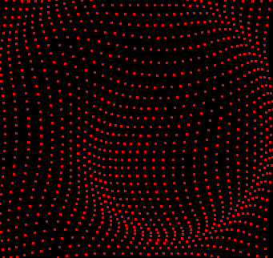
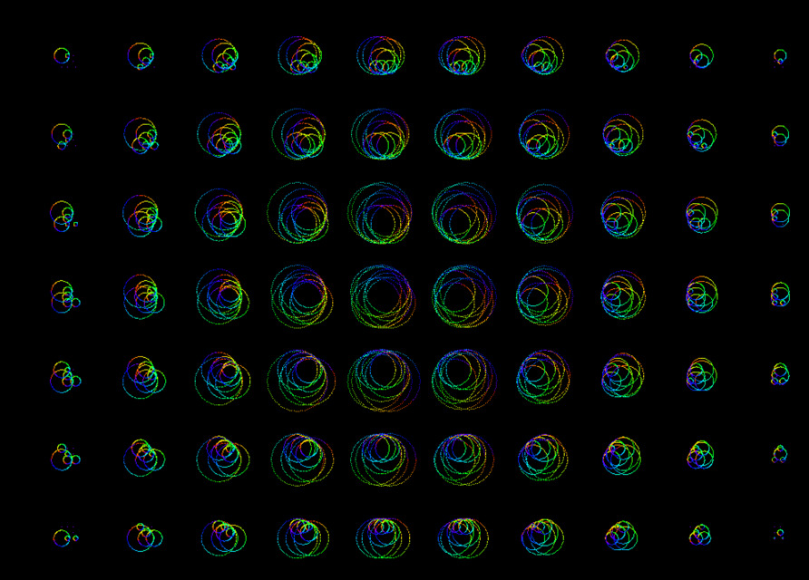
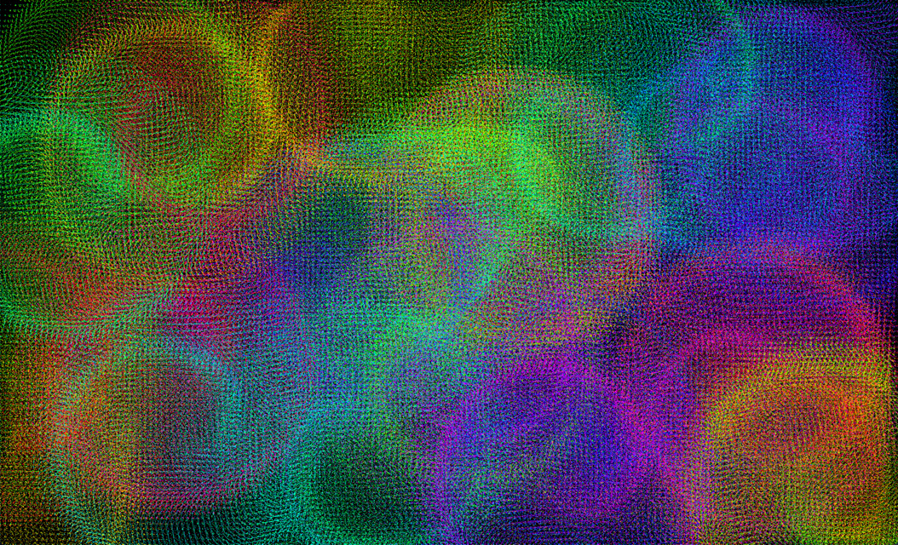
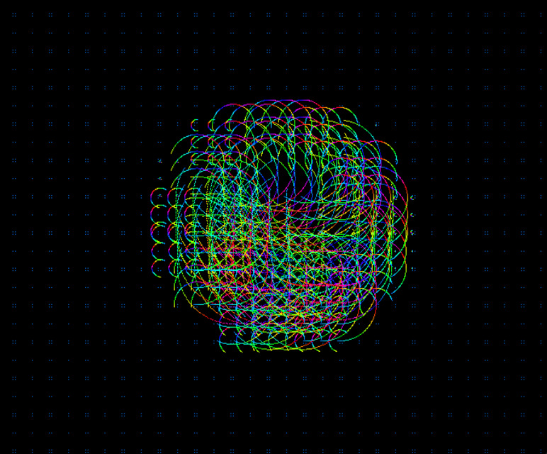
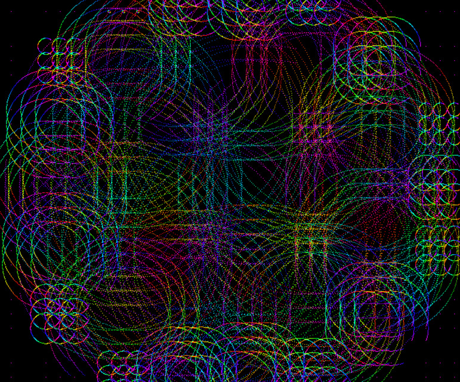
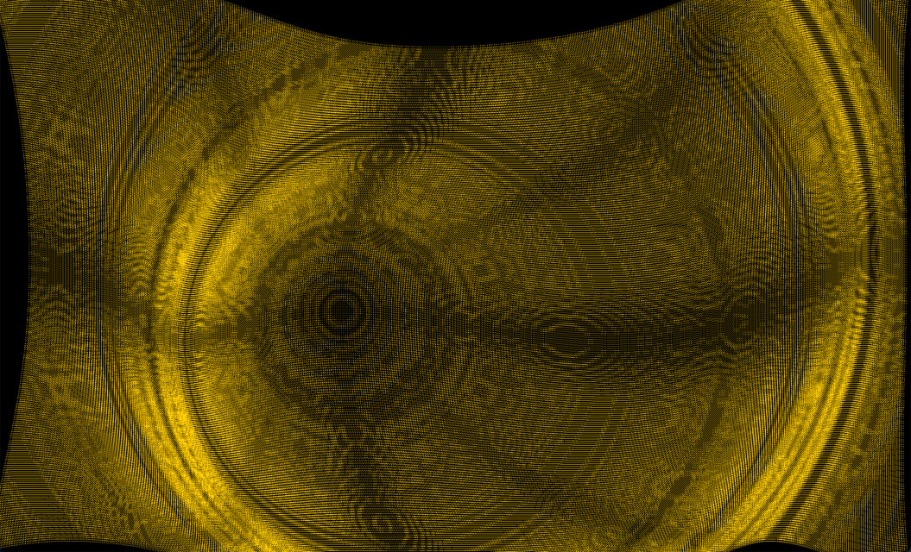
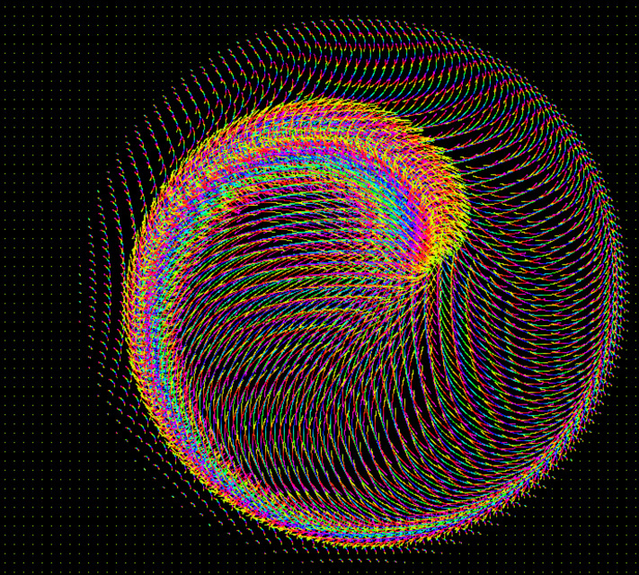
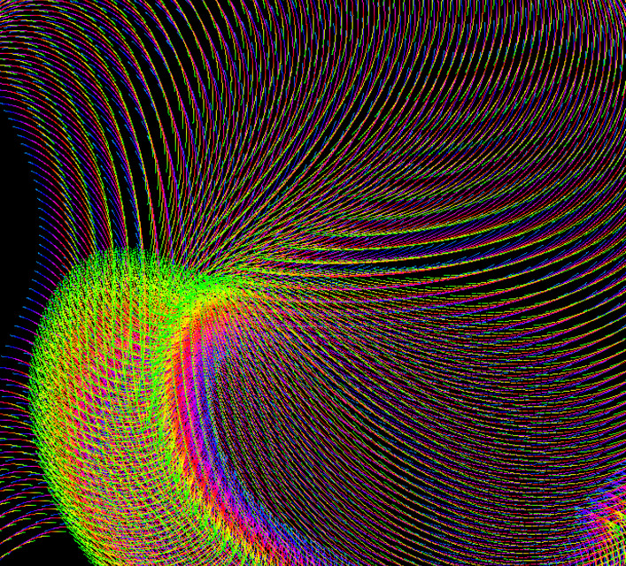
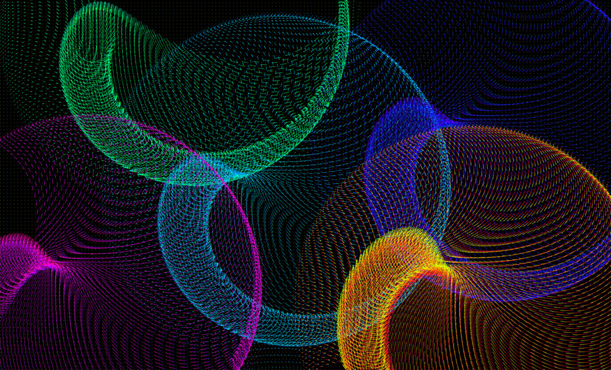
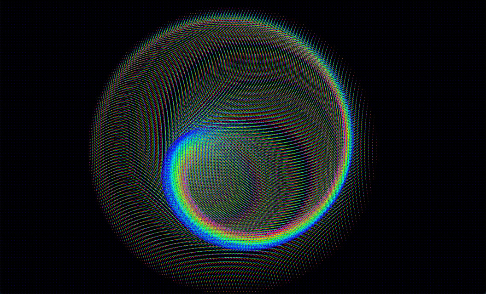

# Waves

`sbt run` should launch the window

## How this works

You mush the buttons and move your mouse around and it produces beautiful pictures. Don't forget to press Space from time to time.

## What is happening
The screen is filled up with dots positioned in a mesh with fixed distance between the dots. The dot nearest the mouse pointer (dot in focus) will rotate in a circle with a radius (adjustable by pressing A and S keys). The further away another dot lies from the mouse pointer, the smaller the radius of the circle in which it travels. Also, the phase at which it rotates will be slightly behind the dot in focus.

How far a ripple will propagate is also controlled by a parameter - maximum propagation (adjustable by pressing Z and X keys). Any dot further than maximum propagation will not move at all.

## Keys

keys | function
--- | ---
A/S | increase/decrease radius of the circle the dot in focus travels in
D/F | This is a strange one. Sometimes I find the dots a bit too small to see, so this is an attempt at making the dots into 3x3 squares, but you can push the neighboring 8 pixels around each dot a bit further out and this can create an interesting effect. Increase/decrease the distance of each of the 8 neighbouring dots (by default they are not drawn. This adds a lot of dots for the program to draw, so if you experience performance issues, reduce this to 0)
I/O | zoom In / Out (increase / decrease the gap between dots)
Z/X | shrink/grow the area affected by the wave (maximum propagation of the wave)
+/- | spin faster / slower
Space | toggle redrawing of the whole canvas on each refresh
T | tether the hue change to every re-draw of the image
P | pause
R | reset all parameters
Q | quit - no questions asked

The window is _resizeable_ so feel free to full-screen it (performance might suffer), or make it smaller if your computer is struggling

## Examples

-------------

App was created by Peter Perhac on Wednesday evening (8 December 2021) and perfected little by little over the next few days.
